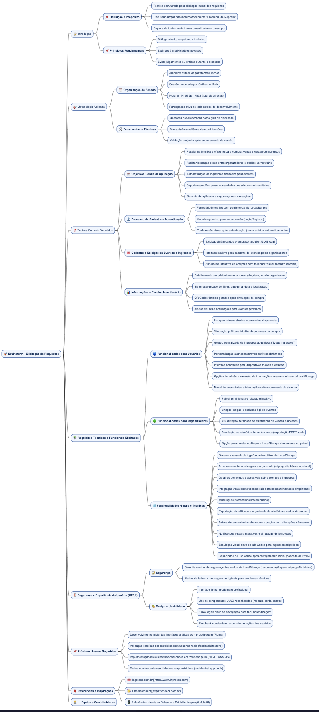
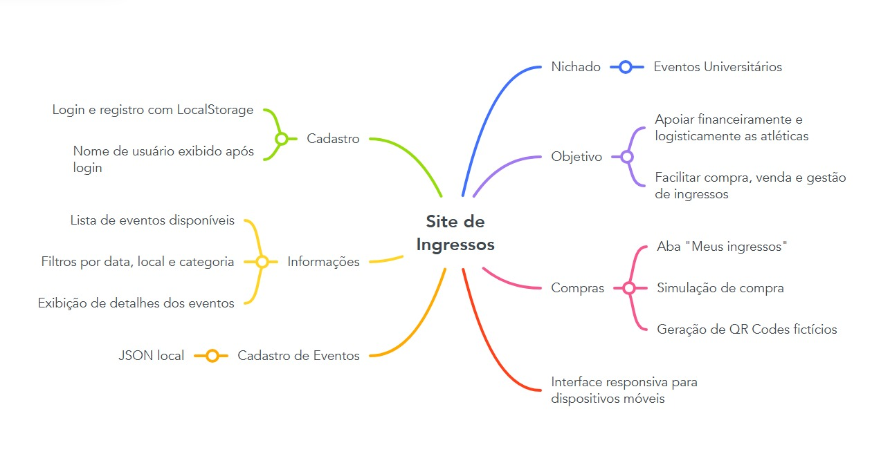

## Introdução

O mapa mental é uma técnica que consiste em criar resumos visuais utilizando símbolos, cores, setas e frases de efeito. O objetivo é organizar o conteúdo e facilitar associações entre as informações destacadas. Esse material é especialmente indicado para pessoas que têm facilidade de aprender de forma visual.

## Metodologia

A equipe se reuniu via Discord para debater ideias gerais sobre o projeto. A reunião ocorreu das 14:53 às 17:53, com Guilherme Reis atuando como moderador. Ele direcionou a equipe na criação do mapa mental, utilizando questões pré-elaboradas para guiar o processo. O documento foi produzido utilizando ferramentas específicas para a criação de mapas mentais.

## Mapa Mental - Geral

## Versão 1.0

### Mapa Mental

### Mapa Mental resumido
[]

## Conclusão

O mapa mental nos ajudou a nos orgnaizar e entender os pontos principais do nossos projeto. Sem dúvidas vai nos ajudar na organização das ideias e no planejamento das próximas etapas.

## Referências
Mapa mental em linguagem .wsd
Versão resumida feita no Canva

## Versionamento
| Data       | Versão | Descrição                | Autor(es)       |
|------------|--------|--------------------------|-----------------|
| 25/03/25   | 1.0    | Criação do documento     | Guilherme Reis        |
| 30/03/25   | 2.0    | Adicionado Mapa Mental 2 | Anderson Lima |
