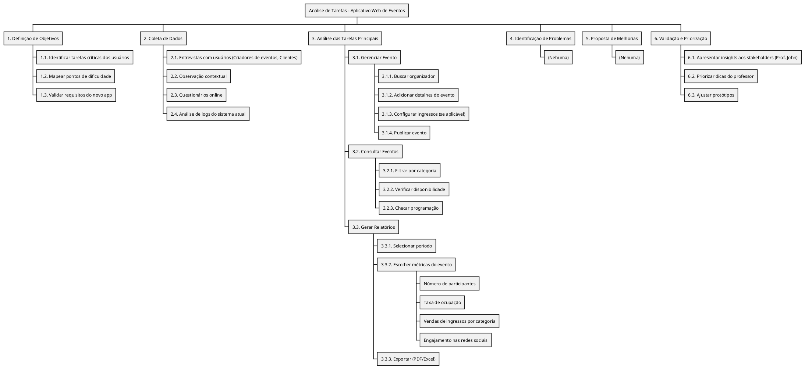
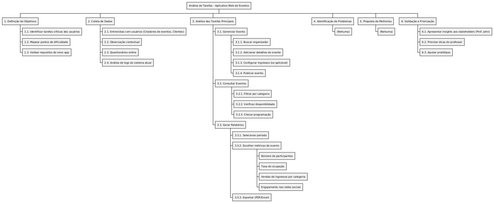
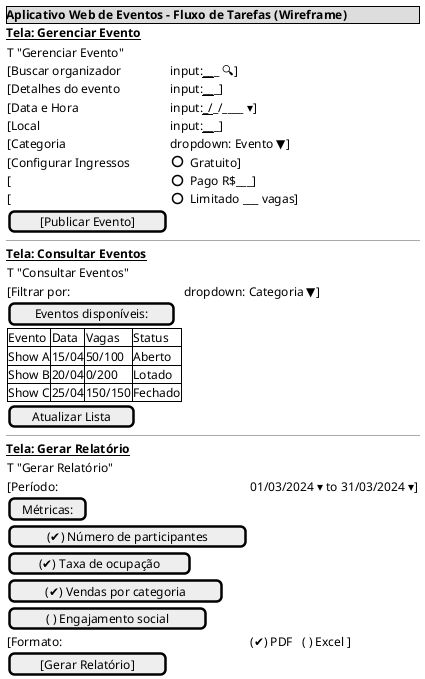
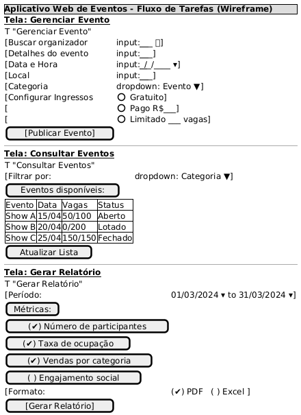
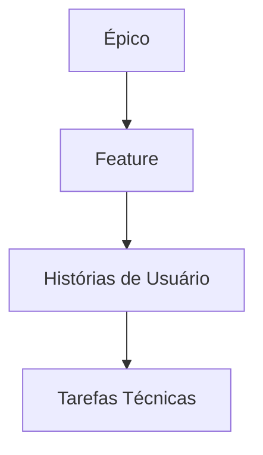

# 06 - **Análise de Tarefas**  

**Contexto:**  

Estámos desenvolvendo um **novo aplicativo web** para facilitar a gestão de eventos, consulta de eventos e atendimento aos participantes. A equipe de UX/UI precisa realizar uma **análise de tarefas** para entender como os usuários (organizadores de eventos, participantes e administradores) interagem com o sistema atual e identificar oportunidades de melhoria.  

---

## **1. Objetivo da Análise de Tarefas**  
- Mapear as principais tarefas realizadas pelos usuários no sistema atual.  
- Identificar pontos de dificuldade, redundâncias e oportunidades de otimização.  
- Validar se o novo aplicativo atenderá às necessidades dos usuários.  

---

## **2. Público-Alvo (Personas)**  
| Perfil          | Tarefas Principais                     |  
|-----------------|----------------------------------------|  
| **Organizador** | Gerenciar eventos, configurar ingressos   |  
| **Administrador**     | Aprovar eventos, gerar relatórios    |  
| **Participante**     | Consultar eventos, fazer inscrições   |  

---

## **3. Métodos de Coleta de Dados**  
- **Entrevistas com usuários:** Perguntar sobre fluxos de trabalho e desafios.  
- **Observação contextual:** Acompanhar usuários em seu ambiente real.  
- **Questionários online:** Coletar feedback quantitativo.  
- **Análise de logs:** Verificar padrões de uso no sistema atual.  

---

## **4. Principais Tarefas a Serem Analisadas**  
| Tarefa                  | Passos Identificados                     | Possíveis Problemas              |  
|-------------------------|------------------------------------------|----------------------------------|  
| **Gerenciar Evento**    | 1. Buscar organizador → 2. Adicionar detalhes → 3. Configurar ingressos → 4. Publicar evento | Lentidão na busca de organizadores |  
| **Consultar Eventos**   | 1. Filtrar por categoria → 2. Verificar disponibilidade → 3. Checar programação | Dados desatualizados |  
| **Gerar relatório**     | 1. Selecionar período → 2. Escolher métricas → 3. Exportar PDF/Excel | Interface confusa |  

---

## **5. Ferramentas Utilizadas**  
- **Mapeamento de fluxo:** **Figma** ou **Miro** para diagramas.  
- **Gravação de sessões:** **Hotjar** ou **Lookback** para análise de interações.  
- **Organização de dados:** **Excel** ou **Airtable** para catalogar tarefas.  

---

## **6. Resultados Esperados**  
- **Lista de tarefas críticas** a serem otimizadas no novo app.  
- **Protótipo de fluxos** aprimorados (ex.: publicação de eventos em menos etapas).  
- **Relatório de insights** com recomendações para a equipe de desenvolvimento.  

---

## **7. Próximos Passos**  
1. Validar os resultados com stakeholders.  
2. Priorizar melhorias com base na análise.  
3. Aplicar mudanças no design do novo aplicativo.  

---

**Conclusão:**  
A análise de tarefas ajudará a garantir que o novo aplicativo web seja **intuitivo, eficiente e alinhado** com as necessidades reais dos usuários.  

---

Aqui está um diagrama **WBS (Work Breakdown Structure)** em **PlantUML** para representar as tarefas da análise de tarefas do aplicativo web:




### **Visualização do Diagrama:**

O diagrama organiza as tarefas em uma estrutura hierárquica, mostrando:

1. **Objetivos** da análise.
2. **Métodos de coleta de dados**.
3. **Tarefas principais** com subtarefas detalhadas.
4. **Problemas identificados**.
5. **Propostas de melhorias**.
6. **Validação final** com stakeholders.

### **Como Usar:**

- Copie o código e cole em um editor PlantUML (como [PlantText](https://www.planttext.com/) ou integrado a ferramentas como VS Code).
- O diagrama será gerado automaticamente.

---

Aqui está um protótipo de **fluxo de tarefas em formato wireframe** usando **PlantUML Salt**, simulando telas básicas do aplicativo web de eventos:



---

### **Características do Protótipo:**

1. **Gerenciar Evento**:
   - Campo de busca com ícone de lupa 🔍
   - Campos para detalhes do evento
   - Configuração de ingressos
   - Botão de ação principal

2. **Consultar Eventos**:
   - Dropdown para filtro
   - Tabela de eventos disponíveis
   - Botão para atualização manual

3. **Gerar Relatório**:
   - Seletores de período
   - Checkboxes para métricas
   - Opções de formato de exportação

---

### **Como Visualizar:**

1. Copie o código para qualquer editor PlantUML (como [PlantText](https://www.planttext.com/))
2. O resultado será um wireframe estático com:
   - Elementos interativos simulados (inputs, dropdowns, checkboxes)
   - Organização visual por telas
   - Anotações contextuais

### **Variações Possíveis:**

- Para **fluxos navegacionais**, adicione setas entre telas:


- Para **detalhar componentes**, use notação `+`:

```plantuml
  @startsalt
  {
    + Botão Primário [Confirmar]
    + Botão Secundário [Cancelar]
  }
  @endsalt
```



Este formato é ideal para **discussões iniciais** com a equipe, permitindo ajustes rápidos antes de protótipos high-fidelity.

---

## **histórias de usuário**

A partir do cenário, análise de tarefas e protótipo, podemos levantar as seguintes **histórias de usuário** utilizando o formato padrão ("Como [persona], quero [ação] para [benefício]"):

---

### **1. Histórias para Organizadores de Eventos**  

**US01** - Como **organizador**, quero **buscar e adicionar detalhes do evento rapidamente** para agilizar a publicação.  
*(Critério de Aceitação: Formulário com validação em tempo real)*  

**US02** - Como **organizador**, quero **configurar diferentes tipos de ingressos** para atender diferentes públicos.  
*(Critério de Aceitação: Opções para gratuito, pago e limitado)*  

**US03** - Como **organizador**, quero **ver o status de ocupação em tempo real** para gerenciar a capacidade do evento.  
*(Critério de Aceitação: Indicador visual de vagas disponíveis)*  

### **2. Histórias para Administradores**  

**US04** - Como **administrador**, quero **aprovar eventos antes da publicação** para garantir qualidade.  
*(Critério de Aceitação: Fluxo de aprovação em duas etapas)*  

**US05** - Como **administrador**, quero **gerar relatórios de participação por período** para análise mensal.  
*(Critério de Aceitação: Opções de PDF/Excel com gráficos embutidos)*  

**US06** - Como **administrador**, quero **receber alertas de eventos lotados** para planejar expansão.  
*(Critério de Aceitação: Notificação quando ocupação >90%)*  

### **3. Histórias para Participantes**  

**US07** - Como **participante**, quero **consultar eventos por categoria** para encontrar eventos de interesse.  
*(Critério de Aceitação: Filtros por tipo, data e localização)*  

**US08** - Como **participante**, quero **inscrever-me em eventos via chat** para resolver dúvidas sem ligar.  
*(Critério de Aceitação: Botão "Inscrever" com chat integrado)*  

### **4. Histórias Técnicas (Derivadas dos Problemas Identificados)**  

**US09** - Como **sistema**, preciso **sincronizar a disponibilidade de vagas a cada 5 minutos** para evitar overselling.  

**US10** - Como **equipe de UX**, queremos **redesenhar o fluxo de relatórios** para reduzir cliques desnecessários.  
*(Critério de Aceitação: Teste A/B com redução de 50% no tempo de geração)*  

### **Priorização (MoSCoW)**  

| Categoria | Histórias                          |  
|-----------|------------------------------------|  
| **Must**  | US01, US03, US09 (críticas para o MVP) |  
| **Should**| US02, US05, US07 (importantes pós-lançamento) |  
| **Could** | US04, US08 (melhorias secundárias) |  
| **Won't** | US10 (postergada para v2.0)        |  

### **Mapeamento para Protótipo**  

| História | Tela no Protótipo Salt | Problema Relacionado |  
|----------|------------------------|----------------------|  
| US01     | "Gerenciar Evento"     | Campo de busca lento |  
| US03     | Tabela de eventos      | Dados desatualizados |  
| US05     | Seção de relatórios    | Interface confusa    |  

### **Próximos Passos**  

1. Validar histórias com stakeholders.  
2. Refinar critérios de aceitação com testes de usuário.  
3. Associar histórias a épicos no backlog (ex.: "Otimização de Gestão de Eventos").  

Essas histórias cobrem todos os pontos críticos identificados na **análise de tarefas** e **protótipo**, garantindo alinhamento entre necessidades do usuário e soluções técnicas.

---

Para organizar as histórias de usuário no **Scrum** em relação a **Épicos** e **Features**, você pode seguir esta estrutura hierárquica, alinhada com as melhores práticas de Agile:

---

### **1. Hierarquia de Organização**  



- **Épico**: Grande iniciativa estratégica (ex.: "Melhorar Gestão de Eventos").  
- **Feature**: Funcionalidade entregável dentro do épico (ex.: "Fluxo de Ingressos").  
- **História de Usuário**: Requisito específico (ex.: "Configurar ingressos").  
- **Tarefas**: Itens técnicos para implementação (ex.: "Criar endpoint de validação de ingressos").  

---

### **2. Exemplo Prático (Baseado no Cenário Anterior)**  

#### **Épico 1: Otimização do Processo de Eventos**  

| Feature                      | Histórias Associadas (US)  |  
|------------------------------|---------------------------|  
| **Busca Rápida de Eventos** | US01 (Busca por categoria) |  
| **Gestão de Ingressos**      | US02, US04 (Aprovação)    |  

#### **Épico 2: Controle de Vagas em Tempo Real**  

| Feature                      | Histórias Associadas (US)  |  
|------------------------------|---------------------------|  
| **Sincronização de Vagas** | US03, US09 (Alertas)      |  

#### **Épico 3: Autoatendimento do Participante**  

| Feature                      | Histórias Associadas (US)  |  
|------------------------------|---------------------------|  
| **Consulta de Eventos**  | US07                      |  
| **Canal de Inscrição**         | US08 (Chat de Inscrições)     |  

---

### **3. Como Priorizar no Backlog**  

1. **Classificar por valor e complexidade**:  
   - US01 e US03 (alto valor, baixa complexidade) → Sprint atual.  
   - US10 (alta complexidade) → Sprint futura.  

2. **Quebrar épicos em features menores**:  
   - Ex.: O épico "Otimização de Eventos" pode ser dividido em:  
     - Feature 1: Busca de eventos (1 sprint).  
     - Feature 2: Ingressos (2 sprints).  

3. **Usar critérios INVEST**:  
   - Garantir que cada história seja **Independente**, **Negociável**, **Valiosa**, **Estimável**, **Pequena** e **Testável**.  

---

### **4. Ferramentas para Organização**  

- **Jira/ClickUp**: Criar épicos > features > histórias.  

```markdown
  [Épico] Melhorar Gestão de Eventos  
    ├── [Feature] Busca Rápida  
    │    ├── US01: Buscar evento em <2s  
    │    └── US05: Filtrar por categoria  
    └── [Feature] Ingressos  
         ├── US02: Configurar ingressos  
         └── US04: Aprovação de admin  
```  

- **Miro**: Mapeamento visual com cores por prioridade.  

---

### **5. Dicas para Refinamento**  

- **Sprint Planning**:  
  - Selecionar features prioritárias e desmembrar em histórias para a sprint.  
  - Ex.: Na Sprint 1, implementar a **Feature "Busca Rápida"** (US01 + US05).  
- **Definição de Pronto (DoD)**:  
  - Para US03 ("Vagas em tempo real"), definir:
    - Integração com API de vagas concluída.  
    - Testes de carga realizados.  

---

### **6. Exemplo de Sprint Backlog**  

| Sprint 1 | Histórias | Prioridade |  
|----------|-----------|------------|  
| **Feature: Busca Rápida** | US01, US05 | Must |  
| **Feature: Ingressos**    | US02      | Should |  

---

### **7. Validação com Stakeholders**  

- Revisar épicos/features a cada **Reunião de Roadmap**.  
- Ajustar prioridades com base no feedback (ex.: adiantar US07 se participantes exigirem busca avançada).  

Essa estrutura mantém o backlog **focado no valor do usuário** e **adaptável a mudanças**, seguindo os princípios do Scrum.
