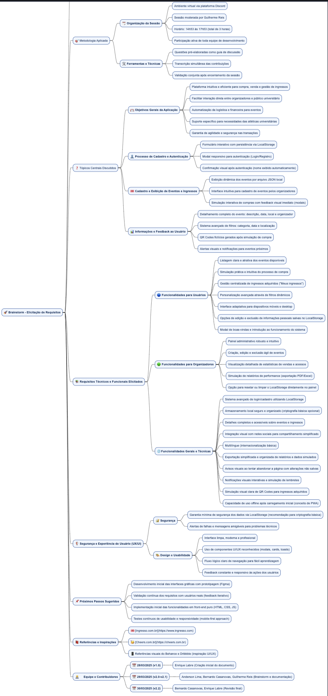

## Introdução

O mapa mental é uma técnica que consiste em criar resumos visuais utilizando símbolos, cores, setas e frases de efeito. O objetivo é organizar o conteúdo e facilitar associações entre as informações destacadas. Esse material é especialmente indicado para pessoas que têm facilidade de aprender de forma visual.

## Metodologia

A equipe se reuniu via Discord para debater ideias gerais sobre o projeto. A reunião ocorreu das 14:53 às 17:53, com Guilherme Reis atuando como moderador. Ele direcionou a equipe na criação do mapa mental, utilizando questões pré-elaboradas para guiar o processo. O documento foi produzido utilizando ferramentas específicas para a criação de mapas mentais.

## Mapa Mental - Geral

## Versão 1.0

### Mapa Mental 1

### Mapa Mental 2

## Conclusão

O mapa mental é uma ferramenta valiosa para oferecer uma visão geral do tema e fixar os pontos mais importantes do projeto. Ele auxilia na organização das ideias e no planejamento das próximas etapas.

## Referências
> Mapa Mental XXX, Disponível em: https://www.....  
> Ferramentas para Mapas Mentais, Disponível em: https://www....  
> Plataforma para usuários colaborarem no desenho, Disponível em: https://...

## Versionamento
| Data       | Versão | Descrição                | Autor(es)       |
|------------|--------|--------------------------|-----------------|
| dd/mm/yy   | 1.0    | Criação do documento     | xxx xxxx        |
| 30/03/25   | 2.0    | Adicionado Mapa Mental 2 | Anderson Lima |
